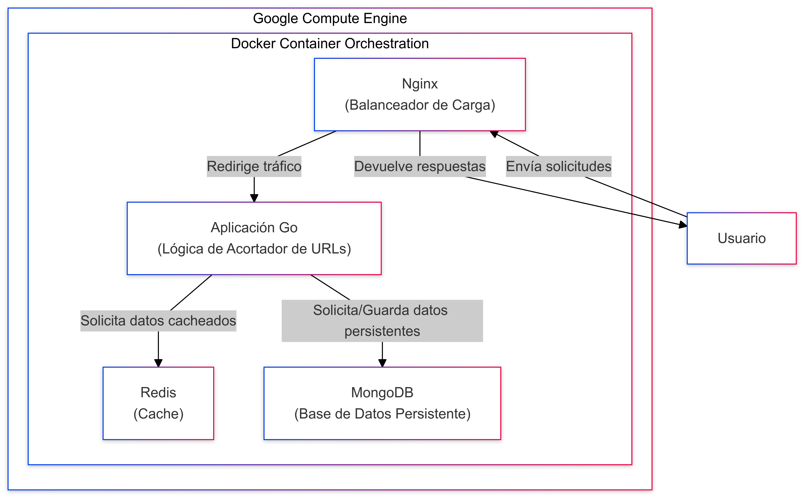

# Documentación del Proyecto Acortador de URLs

Este proyecto es una API para acortar URLs diseñada para manejar tráfico alto y proporcionar estadísticas casi en tiempo
real. Utiliza una arquitectura moderna, programación reactiva y se despliega en Google Cloud Platform para cumplir con
los requisitos de rendimiento y escalabilidad.

---

## Tabla de Contenidos

1. [Resumen del Proyecto](#resumen-del-proyecto)
2. [Pila Tecnológica](#pila-tecnológica)
3. [Arquitectura](#arquitectura)
4. [Instrucciones de Configuración](#instrucciones-de-configuración)
5. [Configuración y Entorno](#configuración-y-entorno)
6. [Ejecución Local con Docker Compose](#ejecución-local-con-docker-compose)
7. [Despliegue en Google Cloud](#despliegue-en-google-cloud)
8. [Swagger API Documentation](#swagger-api-documentation)

---

## Resumen del Proyecto

Este servicio de acortamiento de URLs incluye funcionalidades adicionales:

- Estadísticas de acceso en tiempo real
- Capacidad para habilitar/deshabilitar o modificar URLs acortadas
- Soporte para tráfico alto, manejando hasta 1M RPM
- API REST capaz de manejar aproximadamente 5000 RPM, desplegada en infraestructura en la nube

## Pila Tecnológica

- **Backend**: Go
- **Base de Datos**: MongoDB (pública, sin autenticación para pruebas)
- **Cache**: Redis (memoria caché sin autenticación)
- **Infraestructura en la Nube**: Google Cloud Platform (GCP) con tipo de máquina `e2-standard-4`
- **Programación Reactiva**: `rxgo` para operaciones concurrentes y no bloqueantes
- **Contenerización**: Docker y Docker Compose para desarrollo local

## Arquitectura



### Componentes Clave:

1. **MongoDB**: Almacena de manera persistente la información de URLs.
2. **Redis**: Actúa como capa de caché para URLs de acceso frecuente, mejorando el tiempo de respuesta y reduciendo la
   carga en la base de datos.
3. **Programación Reactiva**:
    - Usando `rxgo` para operaciones no bloqueantes en la creación, obtención de URLs, caché y estadísticas en tiempo
      real.
    - Mejora la escalabilidad y el rendimiento bajo carga intensa.
4. **Balanceador de Carga Nginx**: Distribuye el tráfico entre las réplicas del servicio, configurado como un proxy
   inverso.

---

## Instrucciones de Configuración

### Prerrequisitos

1. **Google Cloud SDK** para gestión de servicios en la nube.
2. **Docker** y **Docker Compose** para desarrollo local.
3. **Go** para desarrollo backend.
4. **rxgo** para programación reactiva (`go get -u github.com/reactivex/rxgo/v2`).

---

## Configuración y Entorno

### MongoDB & Redis

- MongoDB está configurado sin autenticación para este entorno de pruebas.
- Redis funciona como caché, también sin autenticación.

Ambos servicios están contenerizados con Docker Compose para facilitar la configuración.

### Variables de Entorno

- `MONGO_URI`: URI de MongoDB, típicamente `mongodb://localhost:27017` para pruebas locales.
- `REDIS_ADDRESS`: URI de Redis, típicamente `localhost:6379`.

---

## Ejecución Local con Docker Compose

Para iniciar MongoDB y Redis sin autenticación, utiliza Docker Compose.

### `docker-compose.yml`

```yaml
version: '3.8'

services:
  mongo:
    image: mongo:latest
    container_name: mongo
    restart: always
    ports:
      - "27017:27017"
    volumes:
      - mongo-data:/data/db

  redis:
    image: redis:latest
    container_name: redis
    restart: always
    ports:
      - "6379:6379"
    volumes:
      - redis-data:/data

  app:
    build:
      context: .
      dockerfile: Dockerfile
    environment:
      - PORT=8080
      - REDIS_URL=redis:6379
    depends_on:
      - mongo
      - redis
    deploy:
      replicas: 20
      restart_policy:
        condition: on-failure
    healthcheck:
      test: [ "CMD", "curl", "-f", "http://localhost:8080" ]
      interval: 10s
      timeout: 5s
      retries: 3

  load_balancer:
    image: nginx:latest
    container_name: nginx_lb
    restart: always
    ports:
      - "80:80"
    volumes:
      - ./nginx.conf:/etc/nginx/nginx.conf
    depends_on:
      - app
```

Para iniciar el proyecto, ejecuta:

```bash
docker-compose up -d
```

---

## Despliegue en Google Cloud

### Instrucciones para el Despliegue en GCloud

1. **Configurar la Máquina en Google Cloud**:
    - Usa una máquina tipo `e2-standard-4` en **Google Cloud** para manejar el tráfico previsto.
    - Configura Google Cloud para habilitar acceso público a los puertos HTTP/HTTPS y MongoDB.

2. **Configurar el Entorno**:
    - SSH en la instancia y asegura la instalación de **Docker** y **Docker Compose**.
    - Clona el repositorio del proyecto y navega al directorio:
      ```bash
      git clone https://github.com/tuusuario/urlshortener.git
      cd urlshortener
      ```

3. **Desplegar Contenedores**:
    - Usa Docker Compose para iniciar MongoDB, Redis y las réplicas del servicio:
      ```bash
      docker-compose up -d
      ```

4. **Exponer el API**:
    - Configura las reglas de firewall en Google Cloud para aceptar solicitudes HTTP/HTTPS en la instancia.
    - Nginx actúa como balanceador de carga, distribuyendo el tráfico entrante entre las 20 réplicas configuradas.

5. **Escalabilidad y Autoscaling**:
    - Configura el autoscaling de Google Cloud para añadir instancias adicionales en caso de alta carga, si usas un
      grupo de instancias administrado.

---

## Swagger API Documentation

Para facilitar la documentación y pruebas, este proyecto utiliza un archivo Swagger (`openapi-v1.yaml`) que describe la
API. Puedes visualizar la documentación de la API con herramientas como Swagger UI o Postman, y acceder a los siguientes
endpoints principales:

- **POST /shorten**: Acorta una URL larga.
- **GET /{short_url}**: Redirige a la URL original usando el identificador.
- **GET /stats/{short_url}**: Obtiene estadísticas de acceso para una URL acortada.
- **GET /system/stats**: Muestra estadísticas de uso del sistema (CPU, memoria, disco).

Para ver la documentación en Swagger UI, apunta a [openapi-v1.yaml](openapi-v1.yaml).

## Ejemplos de Solicitudes Curl

A continuación, se presentan ejemplos de solicitudes `curl` para interactuar con los endpoints de la API, junto con sus
respuestas.

### Crear una URL Acortada

```bash
curl --location 'http://35.224.157.227/shorten' --header 'Content-Type: application/json' --data '{
    "original_url": "https://www.example.com/very-long-url"
}'
```

**Respuesta:**

```json
{
  "short_url": "http://35.224.157.227/84561f"
}
```

### Redirigir a la URL Original

```bash
curl --location 'http://35.224.157.227/84561f'
```

Esta solicitud redirige al cliente a la URL original.

### Obtener Estadísticas de Acceso para una URL Acortada

```bash
curl --location 'http://35.224.157.227/stats/84561f'
```

**Respuesta:**

```json
{
  "access_count": 1,
  "last_access": "2024-10-26T18:52:06Z"
}
```

### Obtener Estadísticas del Sistema

```bash
curl --location 'http://35.224.157.227/system/stats'
```

**Respuesta:**

```json
{
  "cpu_usage": 6.529538387944046,
  "disk_total": 50884108288,
  "disk_usage": 13.571741576589394,
  "disk_used": 6903582720,
  "memory_total": 16767332352,
  "memory_usage": 4.879339317815891,
  "memory_used": 818135040
}
```
